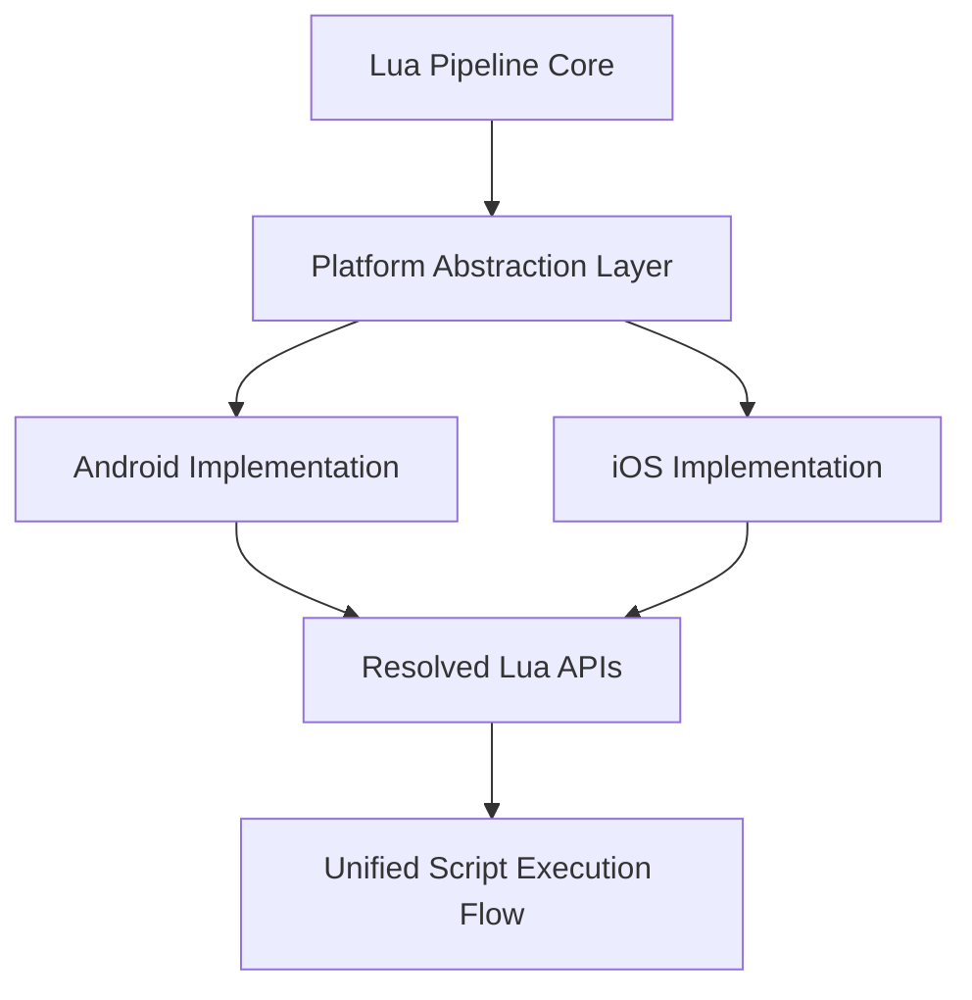

# cross_platform

```mermaid
flowchart TD
    A[Lua Pipeline Core] --> B[Platform Abstraction Layer]
    B --> C[Android Implementation]
    B --> D[iOS Implementation]
    C --> E[Resolved Lua APIs]
    D --> E
    E --> F[Unified Script Execution Flow]

```
