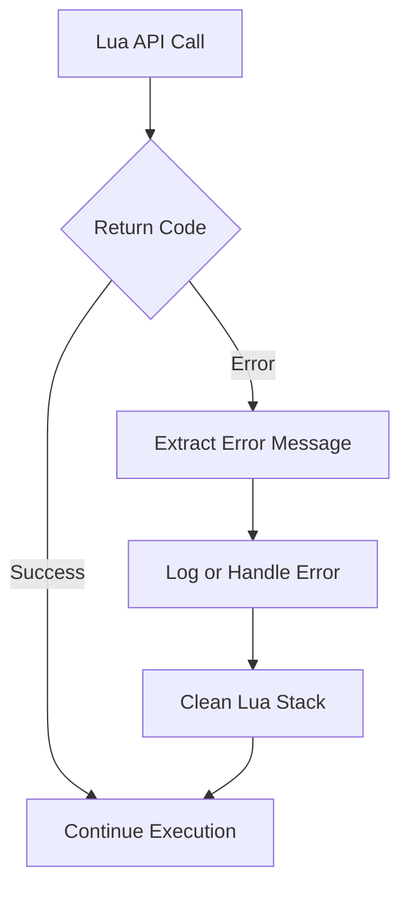

# error_handling

```mermaid
flowchart TD
    A[Lua API Call] --> B{Return Code}
    B -- Success --> C[Continue Execution]
    B -- Error --> D[Extract Error Message]
    D --> E[Log or Handle Error]
    E --> F[Clean Lua Stack]
    F --> C

```
