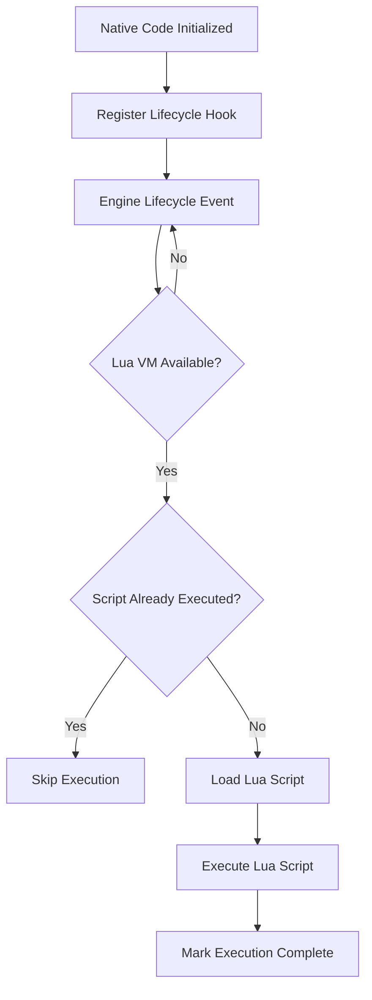

# injection_flow

```mermaid
flowchart TD
    A[Native Code Initialized] --> B[Register Lifecycle Hook]
    B --> C[Engine Lifecycle Event]
    C --> D{Lua VM Available?}
    D -- No --> C
    D -- Yes --> E{Script Already Executed?}
    E -- Yes --> F[Skip Execution]
    E -- No --> G[Load Lua Script]
    G --> H[Execute Lua Script]
    H --> I[Mark Execution Complete]
```
