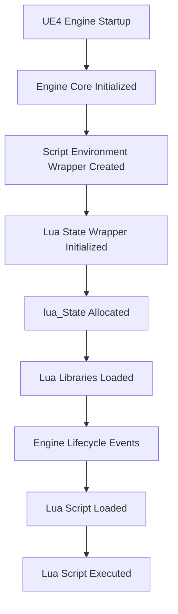

## lua_pipeline

```mermaid
flowchart TD
    A[UE4 Engine Startup] --> B[Engine Core Initialized]
    B --> C[Script Environment Wrapper Created]
    C --> D[Lua State Wrapper Initialized]
    D --> E[lua_State Allocated]
    E --> F[Lua Libraries Loaded]
    F --> G[Engine Lifecycle Events]
    G --> H[Lua Script Loaded]
    H --> I[Lua Script Executed]
```
