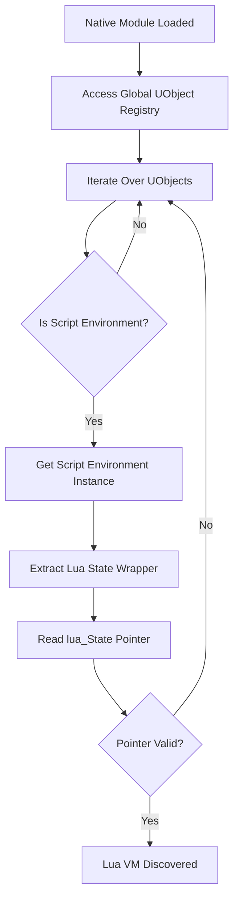

# runtime_discovery

```mermaid
flowchart TD
    A[Native Module Loaded] --> B[Access Global UObject Registry]
    B --> C[Iterate Over UObjects]
    C --> D{Is Script Environment?}
    D -- No --> C
    D -- Yes --> E[Get Script Environment Instance]
    E --> F[Extract Lua State Wrapper]
    F --> G[Read lua_State Pointer]
    G --> H{Pointer Valid?}
    H -- No --> C
    H -- Yes --> I[Lua VM Discovered]
```
