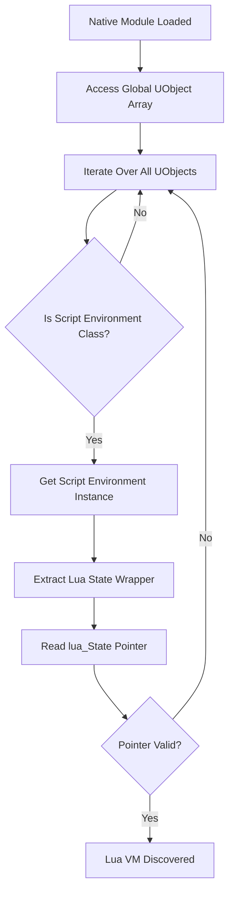
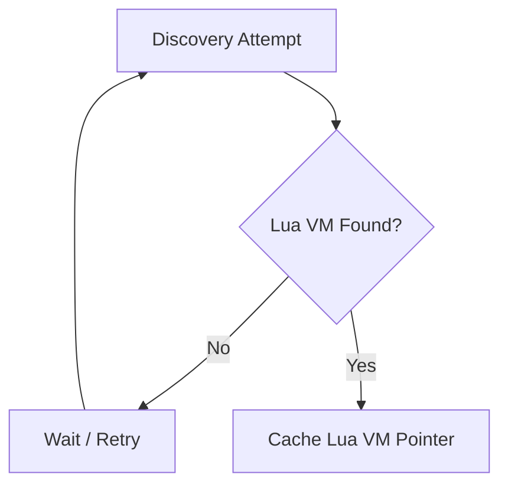

# Runtime Lua VM Discovery

This document explains how an existing Lua virtual machine (VM) can be **discovered at runtime** inside Unreal Engine 4 (UE4) applications.

Rather than creating a new Lua state, the approach focuses on **locating and interfacing with an already-initialized Lua environment** managed by the engine or a scripting plugin.

---

## Why Runtime Discovery

In many UE4 applications:
- Lua is initialized internally by engine plugins
- The Lua VM lifecycle is controlled by the engine
- Creating a second Lua VM may cause instability

Runtime discovery allows native tooling to:
- Observe Lua execution safely
- Integrate scripts without altering engine logic
- Respect existing ownership and lifecycle constraints

---

## Discovery Strategy Overview

The discovery process relies on UE4’s object system:

1. Access the global UObject registry
2. Identify script environment objects
3. Extract the Lua state wrapper
4. Validate the Lua VM pointer

This approach is **engine-native** and does not require source code access.

---

## High-Level Discovery Flow

---

## Runtime Discovery Steps (Summary)

| Step | Phase                 | Description                                  | Result                      |
| ---- | --------------------- | -------------------------------------------- | --------------------------- |
| 1    | Global Object Access  | Read Unreal Engine’s global UObject registry | Iterable object list        |
| 2    | Object Identification | Locate the Lua script environment object     | Script environment instance |
| 3    | Wrapper Extraction    | Access the Lua state wrapper                 | Lua wrapper reference       |
| 4    | Lua State Read        | Extract the `lua_State*` pointer             | Candidate Lua VM            |
| 5    | Pointer Validation    | Perform sanity and stability checks          | Verified Lua VM             |
| 6    | State Caching         | Store the pointer for later use              | Ready Lua context           |

---

## Step 1: Access Global UObject Registry

UE4 maintains a global registry containing all live UObject instances.

This registry:

- Is initialized early during engine startup

- Includes engine, gameplay, and scripting objects

- Can be traversed safely once the engine is running

Object traversal enables reflection-based discovery without hardcoded references

---

## Step 2: Identify Script Environment Object

Lua integrations typically expose a script environment wrapper implemented as a UObject.

Common characteristics:

- Derives from UObject

- Exists as a singleton or limited instance

- Manages initialization and lifetime of the Lua VM

Objects are filtered by class identity and structural patterns.

---

## Step 3: Extract Lua State Wrapper

The script environment object references a Lua state wrapper structure.

The wrapper:

- Holds the lua_State*

- Abstracts direct VM access

- Controls lifetime and execution safety

Native code reads this wrapper to obtain a candidate Lua state pointer.

---

## Step 4: Validate Lua VM Pointer

Before using the discovered pointer, validation is required.

Typical validation checks:

- Pointer is non-null

- Memory alignment is valid

- Address range is reasonable

- Pointer remains stable across reads

These checks prevent invalid memory access and race conditions.

---

## Deferred Discovery Model

Lua VM discovery is often deferred because:

- Script environments may initialize after engine startup

- Lua VMs may be created lazily

- Engine subsystems load asynchronously

A polling-based model is commonly used.

---

## Safety Considerations

This discovery approach is safe because it:

- Does not modify engine logic

- Does not create additional Lua VMs

- Does not force initialization

- Uses the Lua VM only after validation

---

## Common Failure Scenarios

- Script environment not yet initialized

- Incorrect object classification

- Invalid wrapper layout

- Lua VM not created in the current session

All failures are handled via retry or graceful fallback.

---

## Summary

Runtime Lua VM discovery in UE4 is achieved by leveraging:

- The global UObject registry

- Reflection-based object identification

- Script environment wrappers

- Deferred validation and caching

This enables controlled, engine-aware Lua integration suitable for research, tooling, and modding workflows.

---
