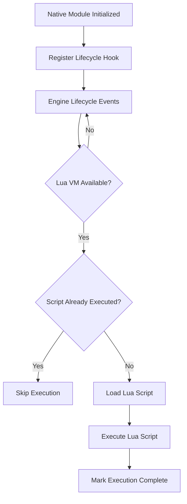
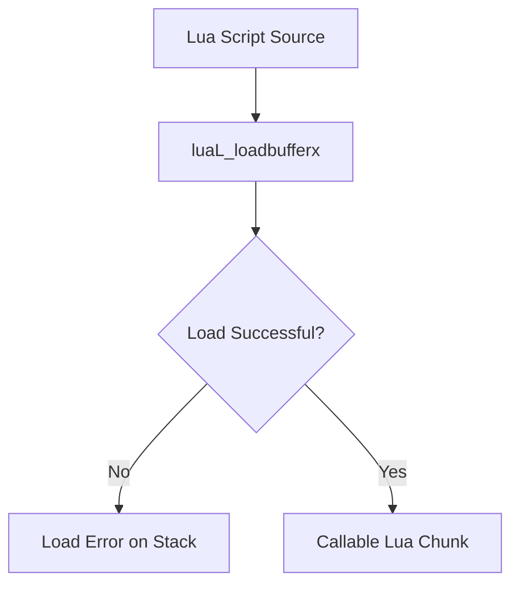
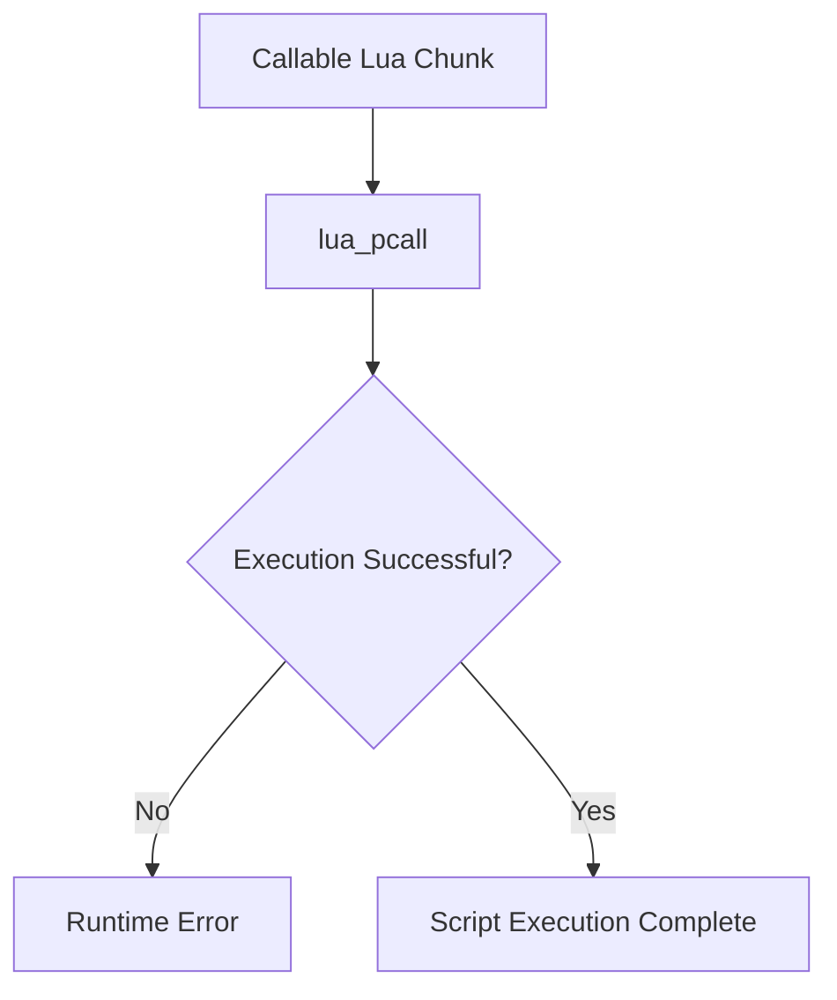

# Lifecycle-Based Script Injection Flow

This document describes how Lua scripts are **integrated and executed at runtime** inside Unreal Engine 4 (UE4) applications after a Lua virtual machine has been discovered.

In this context, *injection* refers to **controlled integration of script execution into the engine lifecycle**, not modification or exploitation of engine logic.

---

## What Injection Means Here

Injection in this project means:

- Attaching Lua script execution to engine lifecycle events  
- Executing scripts only when the engine and Lua VM are fully ready  
- Preserving engine stability and ownership rules  

It does **not** mean:

- Forcing execution at arbitrary times  
- Modifying engine binaries  
- Bypassing engine or platform protections  

---

## Why Lifecycle-Based Injection Is Required

Lua execution must respect UE4 lifecycle timing because:

- The Lua VM may not exist during early startup  
- Script environments can initialize late  
- Engine subsystems load asynchronously  

Executing scripts too early can cause:

- Invalid memory access  
- Undefined behavior  
- Engine crashes  

Therefore, script execution must be **gated by lifecycle conditions**.

---

## Injection Strategy Overview

The injection strategy follows these principles:

1. Observe engine lifecycle events  
2. Wait until a valid Lua VM is available  
3. Execute scripts in a controlled manner  
4. Prevent repeated or unsafe execution  

---

## High-Level Injection Flow

---

## Injection Steps (Summary)

| Step | Phase                 | Description                                            | Result                  |
| ---- | --------------------- | ------------------------------------------------------ | ----------------------- |
| 1    | Module Initialization | Native module loads and prepares lifecycle observation | Ready to observe engine |
| 2    | Lifecycle Observation | Engine events trigger execution checks                 | Safe execution timing   |
| 3    | Lua VM Check          | Verify Lua VM availability and validity                | Execution gate          |
| 4    | Script Load           | Load Lua script into VM                                | Callable Lua chunk      |
| 5    | Script Execute        | Execute script via protected call                      | Script integrated       |
| 6    | State Update          | Mark script as executed                                | Prevent re-execution    |

---

## Step 1: Register Lifecycle Observation

A lifecycle observation point is registered during native module initialization.

Common observation points include:

- Engine update loops

- Event dispatch paths

- Periodic engine callbacks

This hook does not execute scripts directly.
It only observes engine and Lua readiness.

---

## Step 2: Wait for Lua VM Availability

Each lifecycle callback verifies whether:

- The Lua VM has been discovered

- The lua_State pointer is valid

If the VM is not ready:

- Execution is deferred

- Control returns immediately to the engine

This ensures non-intrusive behavior.

---

## Step 3: Prevent Duplicate Execution

Once a script has executed:

- An execution flag is set

- Subsequent lifecycle events skip execution

This guarantees:

- One-time execution (when desired)

- Predictable behavior

- No script flooding

---

## Step 4: Script Load Phase

Lua scripts are loaded using the Lua C API.

During this phase:

- Lua parses the script

- No execution occurs

- Errors are safely reported

---

## Step 5: Script Execution Phase

Loaded scripts are executed using a protected call.

Execution control always returns to native code.

---

## Error Handling During Injection

Errors during injection are:

- Captured via return codes

- Extracted from the Lua stack

- Logged or handled gracefully

Proper handling ensures that Lua errors do not crash the engine.

---

## Why This Injection Model Is Safe

This injection model:

- Respects engine lifecycle ordering

- Avoids premature execution

- Prevents duplicate runs

- Does not modify engine logic

- Uses protected execution boundaries

It is suitable for:

- Research tooling

- Modding frameworks

- Script VM experimentation

---

## Summary

Lifecycle-based injection integrates Lua scripts into UE4 applications by:

- Observing engine readiness

- Deferring execution until safe

- Executing scripts in a controlled manner

- Preserving engine stability

This approach aligns with Unreal Engine’s execution model and enables reliable script integration without engine modification.
