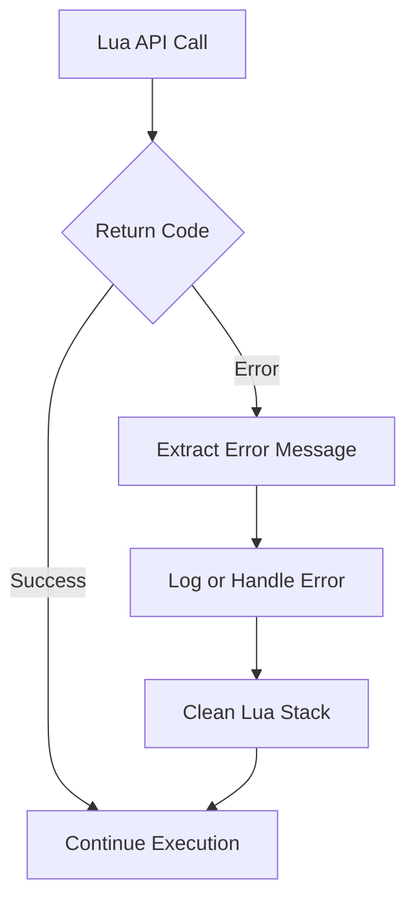
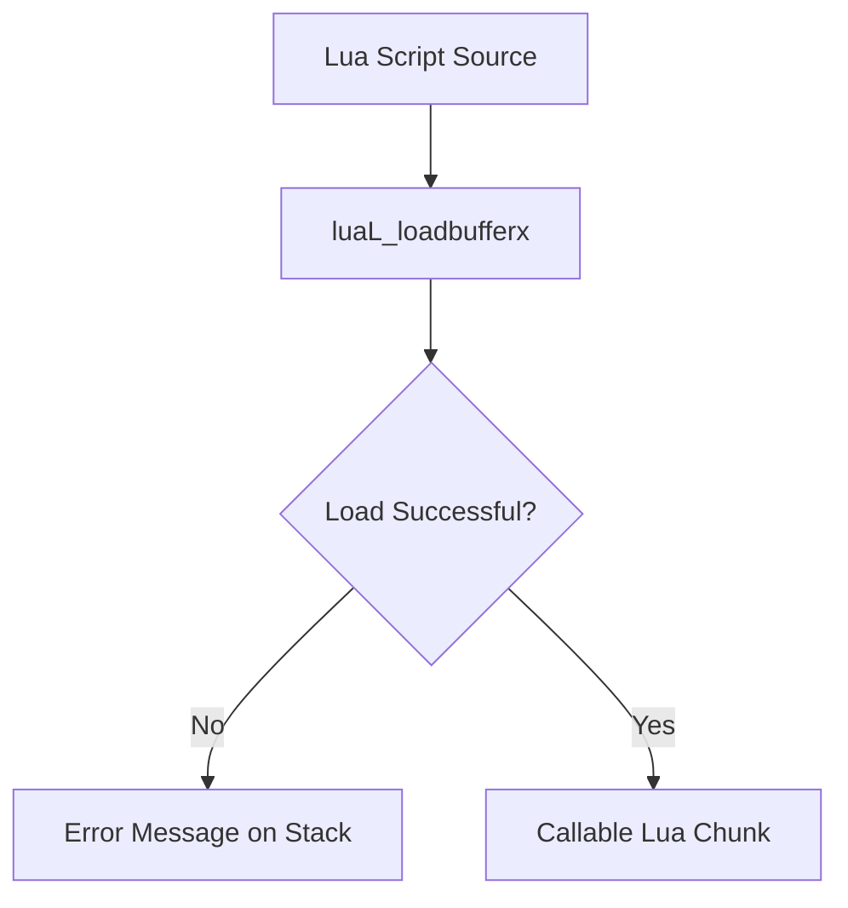
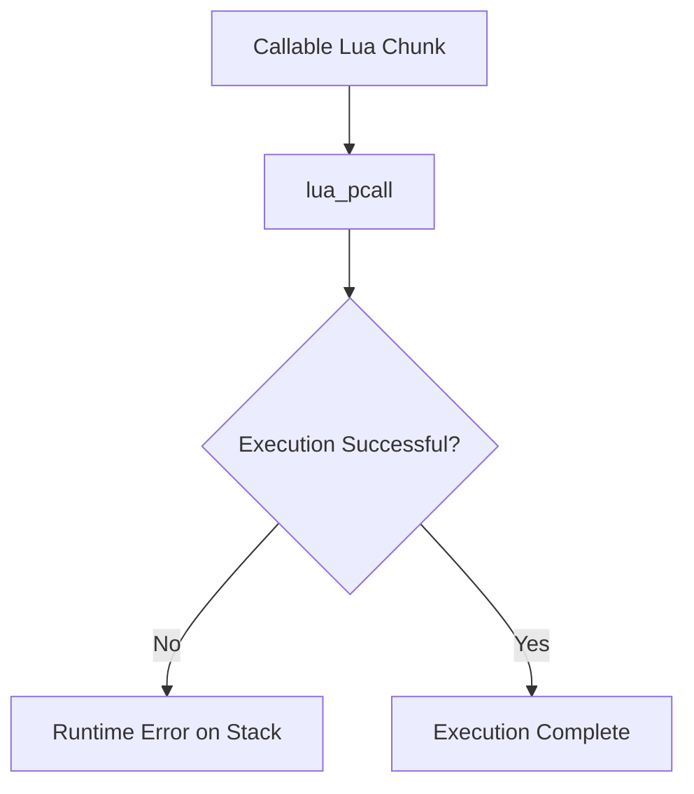

# Error Handling and Stability

This document explains how errors are handled during Lua script loading and execution inside Unreal Engine 4 (UE4) applications.

The focus of this document is on graceful failure, engine stability, and controlled recovery when Lua-related operations encounter errors.

---

## Why Error Handling Matters

Lua scripts execute dynamically at runtime and may fail for multiple reasons, including syntax mistakes, runtime logic errors, missing bindings, or incorrect execution timing.

Without proper error handling, Lua failures can propagate into native code and cause undefined behavior, memory corruption, or engine crashes. A well-designed error handling strategy ensures that Lua script failures do not compromise engine stability.

---

## Error Handling Design Goals

The error handling model in this pipeline is designed around the following goals:

- Prevent Lua errors from crashing the engine
- Maintain a consistent and predictable Lua stack state
- Separate script failures from engine logic
- Allow scripts to fail without halting execution
- Return control safely to native code at all times

---

### High-Level Error Handling Flow

---

## Separation of Error Types

Errors in the Lua scripting pipeline are divided into two primary categories:

### Load-Time Errors

Load-time errors occur when Lua parses a script before execution. These errors typically result from invalid syntax, malformed Lua code, or unsupported language constructs.

When a load-time error occurs:
- The script is not executed
- An error message is generated by Lua
- Native code remains in full control

### Runtime Errors

Runtime errors occur during script execution. These errors may include nil dereferences, invalid arguments, logic mistakes, or missing bindings.

Runtime errors are contained within protected execution boundaries and do not automatically crash the engine.

---

## Protected Execution Model

All Lua script execution in this pipeline is performed using protected calls. This ensures that any error raised by Lua is converted into a controlled return value rather than an exception or crash.

Protected execution guarantees that:
- Errors are detected immediately
- Control always returns to native code
- Recovery logic can be applied safely

---

## Error Message Handling

When an error occurs, Lua places an error message or object on its internal stack. Native code is responsible for extracting this information, converting it into a readable form if necessary, and recording or reporting the error.

After the error message is handled, it must be removed from the Lua stack to restore a clean execution state.

---

## Lua Stack Integrity

Maintaining Lua stack integrity is critical for long-term stability. Every error path must ensure that the Lua stack is restored to a known and predictable state.

Failure to clean up the stack can lead to:
- Incorrect behavior in subsequent script executions
- Memory corruption
- Hard-to-debug crashes occurring much later in execution

---

## Non-Fatal Error Policy

In this scripting pipeline, Lua errors are treated as non-fatal by default. Script failures do not terminate the engine or halt gameplay logic.

This approach is essential for:
- Tooling and instrumentation
- Modding frameworks
- Experimental or user-provided scripts

---

## Defensive Execution Rules

To ensure stability, the following defensive rules are applied:

- Lua APIs are never called with a null or invalid Lua state
- Script execution only occurs after lifecycle readiness checks
- Errors are always handled immediately
- Scripts are not re-executed automatically after failure unless explicitly intended

These rules reduce the risk of cascading failures.

---

## Common Failure Scenarios

Typical failure scenarios encountered in Lua scripting include:

- Syntax errors in scripts
- Missing or incorrectly bound engine APIs
- Execution before the Lua VM is fully initialized
- Improper cleanup after an error
- Incorrect assumptions about script environment state

Each scenario is handled through controlled failure paths and does not compromise engine stability.

---

## Error Handling Steps (Summary)

| Step | Phase               | Description                       | Outcome                    |
| ---- | ------------------- | --------------------------------- | -------------------------- |
| 1    | Lua API Invocation  | Call Lua load or execution API    | Return code generated      |
| 2    | Status Check        | Check success or failure          | Error path or continue     |
| 3    | Error Extraction    | Read error message from Lua stack | Error information obtained |
| 4    | Logging / Reporting | Log or report the error           | Error recorded             |
| 5    | Stack Cleanup       | Remove error value from Lua stack | Stack restored             |
| 6    | Resume Execution    | Return control to engine          | Engine remains stable      |

---

## Error Type Classification

| Error Type            | Occurs During        | Typical Cause                   | Handling Strategy          |
| --------------------- | -------------------- | ------------------------------- | -------------------------- |
| Load-Time Error       | Script loading       | Syntax errors, invalid Lua code | Abort execution, log error |
| Runtime Error         | Script execution     | Logic errors, nil access        | Catch via protected call   |
| Stack Integrity Error | Post-failure cleanup | Missing stack cleanup           | Restore known stack state  |
| Timing Error          | Early execution      | Lua VM not initialized          | Defer execution            |

---

## Summary

Error handling in the UE4 Lua scripting pipeline is built around isolation, protection, and recovery.

By separating load-time and runtime errors, enforcing protected execution, maintaining Lua stack integrity, and treating script failures as non-fatal, the pipeline ensures that Lua scripting remains safe, predictable, and stable even in the presence of faulty scripts.

---
