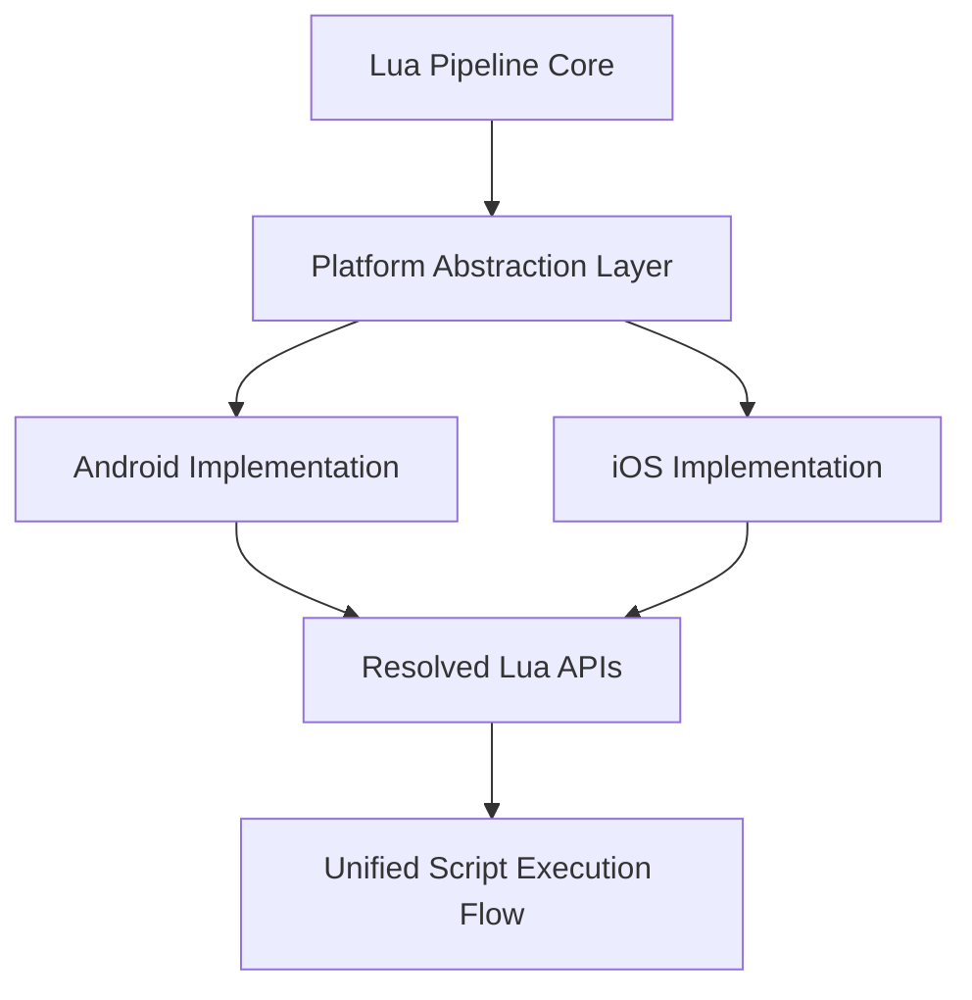

# Cross-Platform Considerations (Android & iOS)

This document explains cross-platform considerations for implementing a Lua scripting pipeline in Unreal Engine 4 (UE4) applications.

The goal is to highlight what remains **common across platforms** and what must be **abstracted or adapted** when targeting Android and iOS environments.

---

## Why Cross-Platform Design Matters

UE4 applications are commonly deployed across multiple platforms. While the Lua scripting pipeline itself is conceptually identical, platform-specific differences affect how native code interacts with the engine and runtime.

A clean cross-platform design ensures:
- Reusability of core logic
- Reduced maintenance overhead
- Predictable behavior across platforms
- Easier debugging and testing

---

## Cross-Platform Architecture Overview

---

## What Stays the Same Across Platforms

The following components are platform-independent:

- Lua scripting pipeline architecture
- Lua virtual machine behavior
- Script loading and execution flow
- Error handling model
- Lifecycle-based execution gating
- High-level discovery and injection logic

These components should reside in shared core modules.

---

## What Differs Across Platforms

Platform-specific differences primarily occur at the **native boundary**.

Common differences include:
- Binary format (ELF vs Mach-O)
- Dynamic loader behavior
- Symbol resolution mechanisms
- Memory layout and address space
- Calling conventions and ABI
- Platform security constraints

These differences require abstraction layers.

---

## Platform Abstraction Strategy

To manage platform differences, the pipeline is divided into:

- Core logic (platform-agnostic)
- Platform abstraction layer
- Platform-specific implementations

This separation ensures that platform-specific code does not leak into core logic.

---

## Android-Specific Considerations

On Android:
- Binaries are ELF-based
- Dynamic loading is handled via `dlopen` / `dlsym`
- The runtime uses Bionic libc
- Address space layout randomization (ASLR) is present
- JNI may coexist with native Lua execution

Special care is required when resolving symbols and managing threading.

---

## iOS-Specific Considerations

On iOS:
- Binaries are Mach-O based
- Dynamic loading relies on the dyld loader
- Symbol visibility is more restricted
- Code signing and entitlements apply
- Objective-C and C++ often coexist

Pointer resolution and lifecycle timing are particularly important on iOS.

---

## Lifecycle Timing Differences

Although UE4 abstracts most lifecycle behavior, platform startup timing can differ.

For example:
- Engine initialization order may vary
- Script environment creation may be delayed differently
- Background execution constraints differ

Therefore, lifecycle-based gating remains essential on all platforms.

---

## Security and Stability Constraints

Both platforms enforce security mechanisms that affect native code:

- Android: SELinux, sandboxing, process isolation
- iOS: Code signing, sandboxing, hardened runtime

The pipeline must operate within these constraints and avoid assumptions about unrestricted access.

---

## Testing and Validation Strategy

Cross-platform testing should ensure:
- Lua VM discovery works reliably
- Script execution timing is correct
- Error handling behaves consistently
- No platform-specific crashes occur

Testing on both platforms is required to validate abstraction correctness.

---

## Platform Responsibility Breakdown

| Layer             | Responsibility                                     | Platform Dependency |
| ----------------- | -------------------------------------------------- | ------------------- |
| Core Pipeline     | Script execution, lifecycle gating, error handling | None                |
| Abstraction Layer | Interface for platform services                    | Minimal             |
| Android Layer     | ELF loading, symbol resolution, threading          | Android             |
| iOS Layer         | Mach-O loading, dyld interaction, runtime timing   | iOS                 |

---

## Platform Differences Summary

| Aspect            | Android            | iOS                   |
| ----------------- | ------------------ | --------------------- |
| Binary Format     | ELF                | Mach-O                |
| Dynamic Loader    | `dlopen` / `dlsym` | dyld                  |
| Runtime Library   | Bionic libc        | Darwin libc           |
| Symbol Visibility | More permissive    | More restricted       |
| Security Model    | SELinux, sandbox   | Code signing, sandbox |

---

## Summary

Cross-platform support in the UE4 Lua scripting pipeline is achieved by:

- Keeping core logic platform-agnostic
- Isolating platform-specific behavior
- Abstracting symbol resolution and loader logic
- Preserving identical execution flow across platforms

This approach enables reliable Lua integration on both Android and iOS without duplicating logic or compromising stability.
